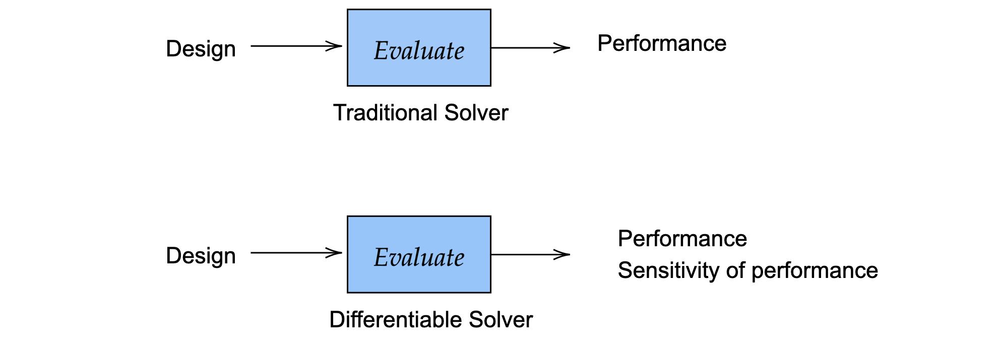
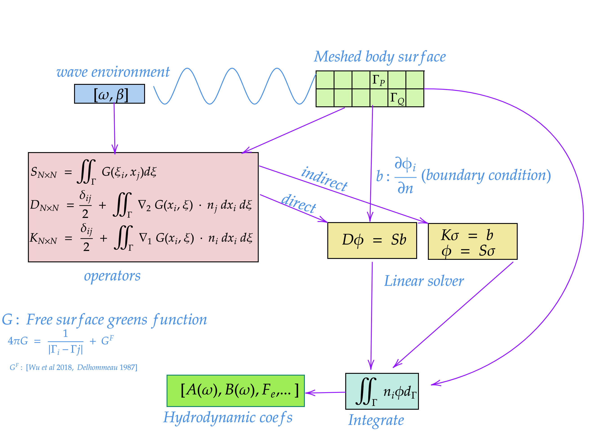
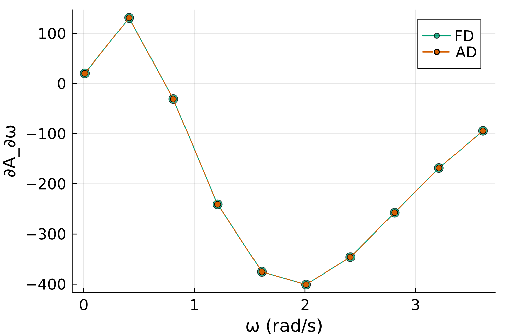
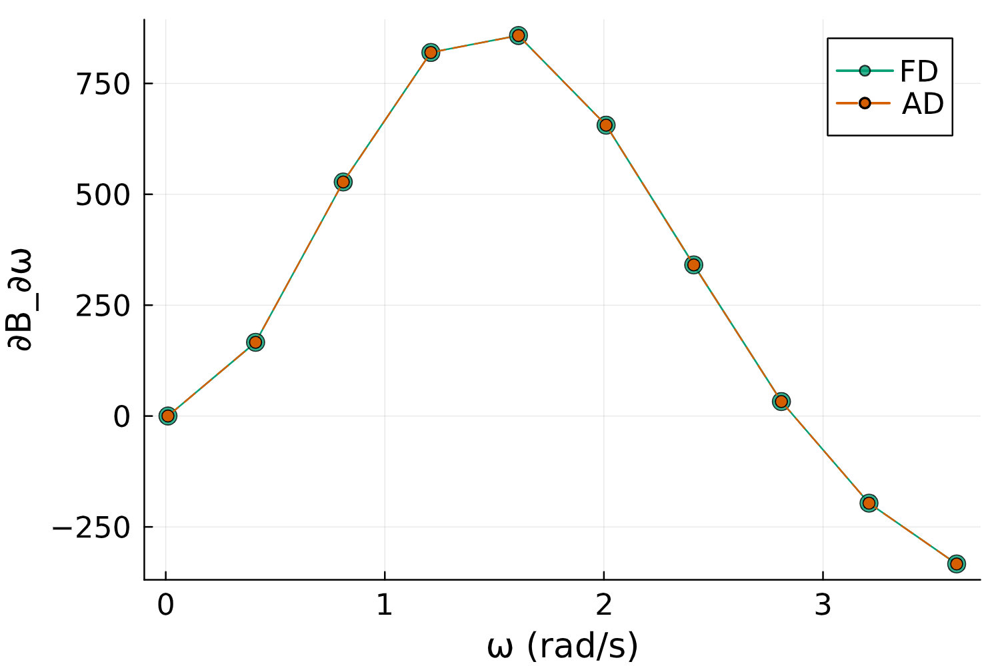
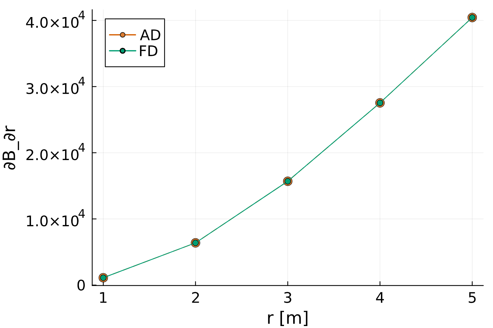
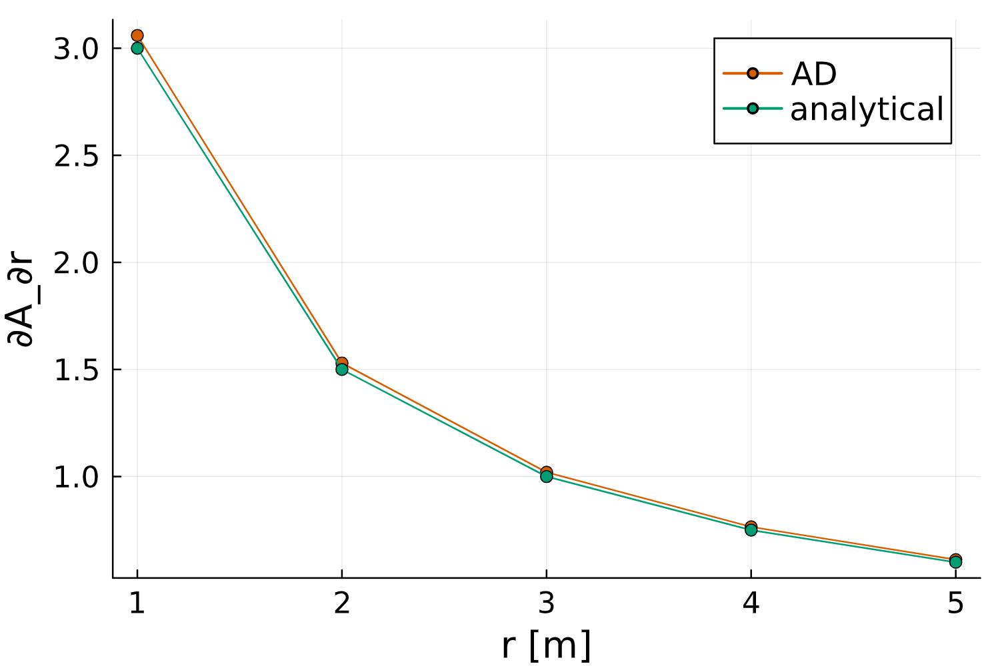

# {.title-slide .centeredslide background-iframe="waves/index.html" loading="lazy"}

::: {style="background-color: rgba(119, 202, 240, 0.75); border-radius: 10px; text-align:center; padding: 0px; padding-left: 1.5em; padding-right: 1.5em; max-width: min-content; min-width: max-content; margin-left: auto; margin-right: auto; padding-top: 0.2em; padding-bottom: 0.2em; line-height: 1.5em!important;"}
<span style="color:#003366; font-size:1.5em; font-weight: bold;">Differentiable Hydrodynamic Analysis</span>  
<span style="color:#003366; font-size:1.2em; font-weight: bold;">using <code>MarineHydro.jl</code></span>  
[<br>&nbsp;]{style="padding-bottom: 0.5rem;"}  
<span style="color:#003366;">Kapil Khanal (PhD Candidate)</span>  
<span style="color:#003366; font-size:0.9em;">Cornell University</span>  

<!-- Add the Sealab logo below -->
<div style="margin-top: 1.5rem;">
  
</div>
:::

---

## Work collaboration with (peer review pending)  {.centeredslide}
::: {.callout title="Contributors" style="text-align:left;!important" .fragment}
Title: <span class="green-text"> **Fully Differentiable Boundary Element Method for Hydrodynamic Sensitivity Analysis of Wave Structure Interaction** </span>

* **Kapil Khanal** (Cornell University)

* **Carlos A. Michelin Strofer** (Sandia National 
Laboratories)

* **Matthieu Ancellin** (Mews Lab)

* **Maha N Haji** (Cornell University)
:::

::: {.callout title="Funding" style="text-align:left;!important" .fragment}
Title: <code>Seedling Grant</code>, Dept. of Energy, Water Power Technologies Office

- Phase I
- Phase II
:::


## Sensitivity of the hydrodynamics simulation
:::: {.columns}
::: {.column width="60%"}

::: {.callout-note title="Goal: Calculate Coefficient and Sensitivity" style="text-align:left;!important"}
$$\left [\mathcal{F}(\mathbf{\theta}) ,\frac{\partial \mathcal{F}(\mathbf{\theta})}{\partial \mathbf{\theta}} \right ] $$
where $\mathcal{F}$ is a hydrodynamic simulation model, *usually BEM* and $\mathbf{\theta} \in \mathbf{R^n}$ is the input parameters.
:::

::: {#fig}
{width=8in height=2.5in }
:::
:::

::: {.column width="40%"}
##### Currently

$$\lim_{\delta \mathbf{\theta} \to 0} \frac{\mathcal{F}(\mathbf{\theta} + \delta \mathbf{\theta}) - \mathcal{F}(\mathbf{\theta})}{\delta \mathbf{\theta}}$$

##### Instead
Differentiable BEM has to differentiate through all operation:

* Green's function and integrals: $G(x,\xi)$ , $\nabla G(x,\xi)$, $\iint G(x,\xi) dA$ 
* Iterative (direct) solvers ($f(x,u)=0$ ) and post-processing steps
:::
::::


## Differentiability via Discrete Adjoint Method {.centeredslide}

:::: {.columns}

::: {.column width="55%"}
::: {.callout-tip title="Constrained optimization"}
$$
\begin{align}
\min_{\theta} \quad & J(\phi(\theta), \theta) \\
\text{subject to} \quad & D(\theta) \phi - S(\theta) b(\theta) = 0 \label{eq_linsys}
\end{align}
$$
:::
<span class="smaller-font"> where $J$ is the cost function, $D$, $S$ are BEM matrices, and $b$ is the boundary condition.</span>

The total derivative of $J$ with respect to $\theta$ is:
$$
\frac{dJ}{d\theta} = 
\underbrace{\textcolor{skyblue}{\frac{\partial J}{\partial \theta}}}_{\textcolor{skyblue}{\text{Direct}}} + 
\underbrace{\textcolor{orange}{\left( \frac{\partial J}{\partial \phi} \right)^T \frac{\partial \phi}{\partial \theta}}}_{\textcolor{orange}{\text{Indirect}}}
$$
:::

::: {.column width="45%"}
To compute $\textcolor{orange}{\frac{\partial \phi}{\partial \theta}}$, the linear system should be perturbed:
\begin{align}
\frac{\partial (D\phi)}{\partial \theta} &= \frac{\partial (Sb)}{\partial \theta} \\
\end{align}

::: {.callout-tip title="Avoid Perturbing Linear System Many Times"}
- [**Idea**]{.green-text}: Avoid resolving $D(\theta) \phi - S(\theta) b(\theta) = 0$ for every perturbation of $\theta_i \in \mathbb{R}^n$.
- [**Solution**]{.green-text}: Use the adjoint method to compute $\frac{\partial \phi}{\partial \theta}$.
:::
:::


::::


---
Perturb the linear system:

$$
\frac{\partial D}{\partial \theta} \phi + D \frac{\partial \phi}{\partial \theta} = \frac{\partial S}{\partial \theta} b + S \frac{\partial b}{\partial \theta}
$$

$$
D \frac{\partial \phi}{\partial \theta} = S \frac{\partial b}{\partial \theta} + b \frac{\partial S}{\partial \theta} - \phi \frac{\partial D}{\partial \theta}
$$

$$
\frac{\partial \phi}{\partial \theta} = D^{-1} \left( S \frac{\partial b}{\partial \theta} + b \frac{\partial S}{\partial \theta} - \phi \frac{\partial D}{\partial \theta} \right)
$$


Substituting $\frac{\partial \phi}{\partial \theta}$ and grouping terms from left to right
$$
\begin{align}
     \lambda^T  &= \frac{\partial J}{\partial \phi}  D^{-1}\\
      \lambda^T D  &= \frac{\partial J}{\partial \phi}
\end{align}
$$

* This is the adjoint linear solve. The same $D$ matrix is used.


## Implicit Differentiation through solvers {.incremental}

The gradient of $J$ with respect to $\theta$ is then expressed as: 
$$
\begin{equation}
\frac{\partial J}{\partial \theta} = \frac{\partial J}{\partial \theta} +  \lambda^T \left( \frac{\partial b}{\partial\theta}S + b\frac{\partial S}{\partial\theta} -  \phi\frac{\partial D}{\partial\theta} \right)
\label{eq:grad_theta}
\end{equation}
$$

All individual partials are computed using Automatic Differentiation. 


- Similar derivation required for all linear and non-linear solves.
- Implicit Differentiation **at the solution**.
* Multibody multidof linear solve
* Transfer function 
* Extends to iterative solvers (GMRES, etc.) and nonlinear solvers (Newton, etc.) as well.

## MarineHydro.jl
:::: {.columns}
::: {.column width="50%"}
- supports reverse-mode automatic differentiation (aka backpropagation)
- The adjoint method for all linear solve is <code>automated</code> in MarineHydro.jl.
- GPU support (Matthieu!)
- 100% Julia implementation for hydrodynamics.

*   **Key Benefits**:
    *   **Design Optimization**: Integrate into gradient based optimization.
    *   **Sensitivity Analysis**: Understand how changes in inputs affect the simulation output.
:::

::: {.column width="50%"}
{width=10in height=5in }
:::

::::

## Comparison with Finite Differences and Analytical Gradients {.custom-dimensions}
::: {.columns}
::: {.column width="50%" .fragment}
{width=80%}
:::
::: {.column width="50%" .fragment}
{width=80%}
:::
:::

::: {.columns}
::: {.column width="50%" .fragment}
{width=80%}
:::
::: {.column width="50%" .fragment}
{width=80%}
:::
:::

## using <code>MarineHydro.jl</code>

import your mesh (we use Capytaine)
```julia
using MarineHydro
using LinearAlgebra 
using PyCall
cpt = pyimport("capytaine")
radius = 1.0 #fixed
resolution = (14, 14)
cptmesh = cpt.mesh_sphere(name="sphere", radius=radius, center=(0, 0, 0), resolution=resolution) 
cptmesh.keep_immersed_part(inplace=true)
```

Load the capytaine mesh and calculate the hydrodynamic coefficients.  
```julia
# declare it Julia mesh
mesh = Mesh(cptmesh)  
ω = 1.03
ζ = [0,0,1] # HEAVE: will be more verbose in future iteration. define it again even if defined in Capytaine.
F = DiffractionForce(mesh,ω,ζ)
A,B = calculate_radiation_forces(mesh,ζ,ω)
```
Calculate gradients of the hydrodynamic coefficients with respect to $\omega$
```julia
# differentiabilittiy 
using Zygote
A_w_grad, = Zygote.gradient(w -> calculate_radiation_forces(mesh,ζ,w)[1],ω)
```


## **References** {#refs}- 
@foreman2024