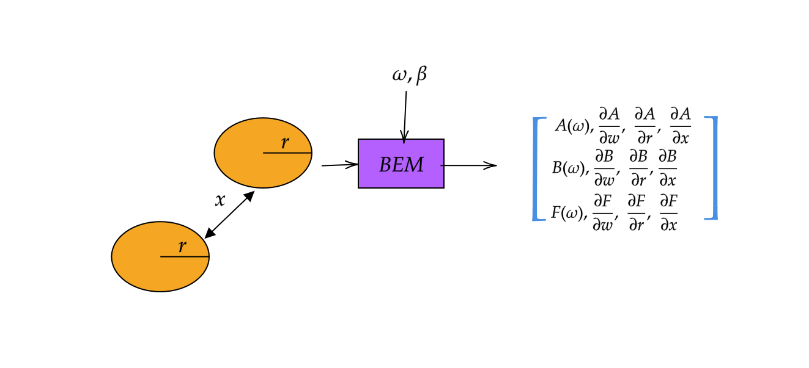

## **BEM Solver in Julia**

:::: {.columns}

::: {.column width="50%"}
#### **Key Features**
- Julia implementation for hydrodynamics.  
- Simplified & parallelizable (free surface) Green’s function [@LIANG201880].  
- First-order gradients via automatic differentiation.  
- GPU-ready influence matrix assembly.  
:::

::: {.column width="50%"}
{width=100%}
**Figure**: Non-dimensional added mass for a hemisphere.  
:::

::::  

---

## **Differentiable (Physics) Numerical Simulation**

:::: {.columns}

::: {.column width="60%"}
##### **Core Idea** {.smaller}
$$\frac{\partial f(\mathbf{x})}{\partial \mathbf{x}} = \lim_{\delta \mathbf{x} \to 0} \frac{f(\mathbf{x} + \delta \mathbf{x}) - f(\mathbf{x})}{\delta \mathbf{x}}$$

where $f$ is a *simulation model* and $\mathbf{x}$ is the input parameters.

*   **Key Benefits**:
    *   **Optimization**: Integrate into gradient based optimization.
    *   **Sensitivity Analysis**: Understand how changes in inputs affect the simulation output.
    *   **Inverse Design**: Determine the input parameters needed to achieve a desired output.

:::

::: {.column width="40%"}
    {width=120%}

Figure: Differentiable BEM 
:::

::::

## MarineHydro.jl
- supports reverse-mode automatic differentiation (aka ==backpropagation==)
- automates discrete adjoint method 
- GPU support (incoming!)
- 100% Julia implementation for hydrodynamics.

## Discrete Adjoint Method

$$
\begin{aligned}
\min_{\theta, \phi} \quad & J(\phi(\theta), \theta) \\
\text{subject to} \quad & D(\theta) \phi - S(\theta) b(\theta) = 0,
\end{aligned}
$$

where $J$ is the cost function, $D$, $S$ are BEM matrices, and $b$ is the boundary condition.
The total derivative of  $J$  with respect to  $\theta$  is expressed as:

\begin{equation}
   \frac{d J}{d\theta} = \frac{\partial J}{\partial \theta}  + \left( \frac{\partial J}{\partial \phi} \right )^T \frac{\partial \phi}{\partial \theta}.
    \label{eq:total}
\end{equation}

---
$$
\begin{align}
     \lambda^T  &= \frac{\partial J}{\partial \phi}  D^{-1}\\
      \lambda^T D  &= \frac{\partial J}{\partial \phi}
\end{align}
$$
The gradient of $\mathcal{J}$ with respect to $\theta$ is then expressed as: 
$$
\begin{align}
\frac{\partial J}{\partial \theta} = \frac{\partial \mathcal{J}}{\partial \theta} +  \lambda^T \left( \frac{\partial b}{\partial\theta}S + b\frac{\partial S}{\partial\theta} -  \phi\frac{\partial D}{\partial\theta} \right)
\end{align}
$$

## **References** {#refs}
