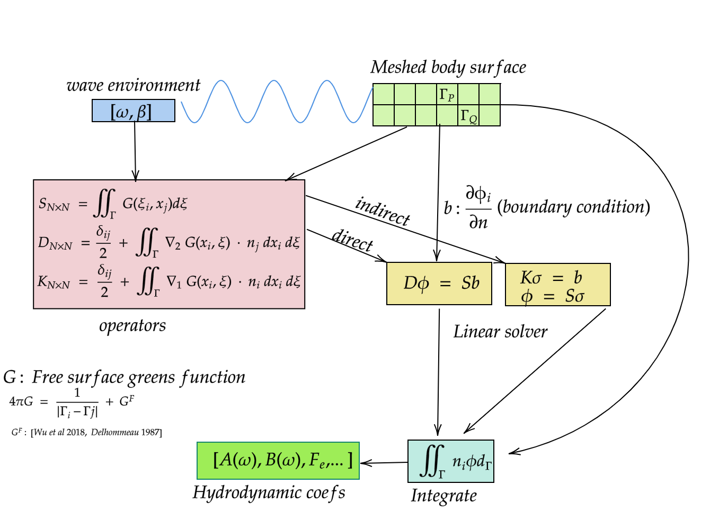

# {.title-slide .centeredslide background-iframe="https://saforem2.github.io/grid-worms-animation/" loading="lazy"}

::: {style="background-color: rgba(22,22,22,0.75); border-radius: 10px; text-align:center; padding: 0px; padding-left: 1.5em; padding-right: 1.5em; max-width: min-content; min-width: max-content; margin-left: auto; margin-right: auto; padding-top: 0.2em; padding-bottom: 0.2em; line-height: 1.5em!important;"}
<span style="color:#939393; font-size:1.5em; font-weight: bold;">Differentiable Hydrodynamic Analysis</span>  
<span style="color:#777777; font-size:1.2em; font-weight: bold;">using <code>MarineHydro.jl</code></span>  
[<br>&nbsp;]{style="padding-bottom: 0.5rem;"}  
<span style="color:#bbbbbb;">Kapil Khanal</span>  
<span style="color:#888888; font-size:0.9em;">Cornell University</span>  
:::

<!-- 
## **BEM Solver in Julia**

:::: {.columns}

::: {.column width="50%"}
#### **Key Features**
- Julia implementation for hydrodynamics.  
- Simplified & parallelizable (free surface) Green’s function [@LIANG201880].  
- First-order gradients via automatic differentiation.  
- GPU-ready influence matrix assembly.  
:::

::: {.column width="50%"}
{width=100%}
**Figure**: Non-dimensional added mass for a hemisphere.  
:::

::::   -->

---

## **Differentiable (Physics) Numerical Simulation**

:::: {.columns}
::: {.column width="50%"}
##### **Core Idea** {.smaller}

::: {.callout-note title="Goal" style="text-align:left;!important"}
$$\frac{\partial BEM(\mathbf{x})}{\partial \mathbf{x}} = \lim_{\delta \mathbf{x} \to 0} \frac{BEM(\mathbf{x} + \delta \mathbf{x}) - BEM(\mathbf{x})}{\delta \mathbf{x}}$$
where $BEM$ is a *hydrodynamic simulation model* and $\mathbf{x}$ is the input parameters.
:::

##### <span style="color:#00CCFF;">Differentiation through simulation</span> 
Means differentiation through:  

- Green's function
- Quadrature methods  
- Linear solvers, and nonlinear solvers, iterative solvers  
:::

::: {.column width="49%"}

:::
::::


## <MarineHydro.jl
:::: {.columns}
::: {.column width="50%"}
- supports reverse-mode automatic differentiation (aka backpropagation)
- automates discrete adjoint method 
- GPU support (incoming!)
- 100% Julia implementation for hydrodynamics.

*   **Key Benefits**:
    *   **Design Optimization**: Integrate into gradient based optimization.
    *   **Sensitivity Analysis**: Understand how changes in inputs affect the simulation output.
:::

::: {.column width="50%"}

:::

::::

## Discrete Adjoint Method

$$
\begin{align}
\min_{\theta, \phi} \quad & J(\phi(\theta), \theta) \\
\text{subject to} \quad & D(\theta) \phi - S(\theta) b(\theta) = 0 \label{eq_linsys}
\end{align}
$$

where $J$ is the cost function, $D$, $S$ are BEM matrices, and $b$ is the boundary condition.

The total derivative of $J$ with respect to $\theta$ is:
$$
\begin{align}
\frac{d J}{d\theta} = \frac{\partial J}{\partial \theta}  + \left( \frac{\partial J}{\partial \phi} \right )^T \frac{\partial \phi}{\partial \theta}.
\end{align}
$$

To compute $\frac{\partial \phi}{\partial \theta}$, the linear system (Eq.\ref{eq_linsys}) is perturbed as follows:
$$
\begin{equation}
\frac{\partial (D\phi)}{\partial \theta} &= \frac{\partial (Sb)}{\partial \theta} \\
\end{equation}
\label{eq:total}
$$


---
$$
\begin{aligned}
\frac{\partial D}{\partial \theta} \phi + D \frac{\partial \phi}{\partial \theta} &= \frac{\partial S}{\partial \theta} b + S \frac{\partial b}{\partial \theta} \\
D \frac{\partial \phi}{\partial \theta} &= S \frac{\partial b}{\partial \theta} + b \frac{\partial S}{\partial \theta} - \phi \frac{\partial D}{\partial \theta} \\
\frac{\partial \phi}{\partial \theta} &= D^{-1} \left( S \frac{\partial b}{\partial \theta} + b \frac{\partial S}{\partial \theta} - \phi \frac{\partial D}{\partial \theta} \right)
\end{aligned}
$$
Substituting $\frac{\partial \phi}{\partial \theta}$ from Eq.~\ref{eq:linsys4} into Eq.~\ref{eq:total} and grouping terms from left to right
$$
\begin{align}
     \lambda^T  &= \frac{\partial J}{\partial \phi}  D^{-1}\\
      \lambda^T D  &= \frac{\partial J}{\partial \phi}
\end{align}
$$

This is the adjoint linear solve. The same $D$ matrix is used.

## Implicit Differentiation through solvers {.incremental}

The gradient of $J$ with respect to $\theta$ is then expressed as: 
$$
\begin{equation}
\frac{\partial J}{\partial \theta} = \frac{\partial J}{\partial \theta} +  \lambda^T \left( \frac{\partial b}{\partial\theta}S + b\frac{\partial S}{\partial\theta} -  \phi\frac{\partial D}{\partial\theta} \right)
\label{eq:grad_theta}
\end{equation}
$$

All individual partials are computed using Automatic Differentiation in $\ref{eq:grad_theta}$. 


- Similar derivation required for all linear and non-linear solves.
- The adjoint method for all linear solve is automated in MarineHydro.jl.

* Integral equation linear solve
* Transfer function linear solve
* Multibody multidof linear solve
* Extends to iterative solvers (GMRES, etc.) and nonlinear solvers (Newton, etc.) as well.


## Comparison with Finite Differences {.custom-dimensions}
::: {.columns}
::: {.column width="50%"}
{width=80%}
:::
::: {.column width="50%"}
{width=80%}
:::
:::

::: {.columns}
::: {.column width="50%"}
{width=80%}
:::
::: {.column width="50%"}
{width=80%}
:::
:::

## using <code>MarineHydro.jl</code>

import your mesh (we use Capytaine)
```julia
using MarineHydro
using LinearAlgebra 
using PyCall
cpt = pyimport("capytaine")
radius = 1.0 #fixed
resolution = (14, 14)
cptmesh = cpt.mesh_sphere(name="sphere", radius=radius, center=(0, 0, 0), resolution=resolution) 
cptmesh.keep_immersed_part(inplace=true)
```

Load the capytaine mesh and calculate the hydrodynamic coefficients.  
```julia
# declare it Julia mesh
mesh = Mesh(cptmesh)  
ω = 1.03
ζ = [0,0,1] # HEAVE: will be more verbose in future iteration. define it again even if defined in Capytaine.
F = DiffractionForce(mesh,ω,ζ)
A,B = calculate_radiation_forces(mesh,ζ,ω)
```
Calculate gradients of the hydrodynamic coefficients with respect to $\omega$
```julia
# differentiabilittiy 
using Zygote
A_w_grad, = Zygote.gradient(w -> calculate_radiation_forces(mesh,ζ,w)[1],ω)
```


## **References** {#refs}- 
slides theme - https://samforeman.me/posts/dope-slides/
