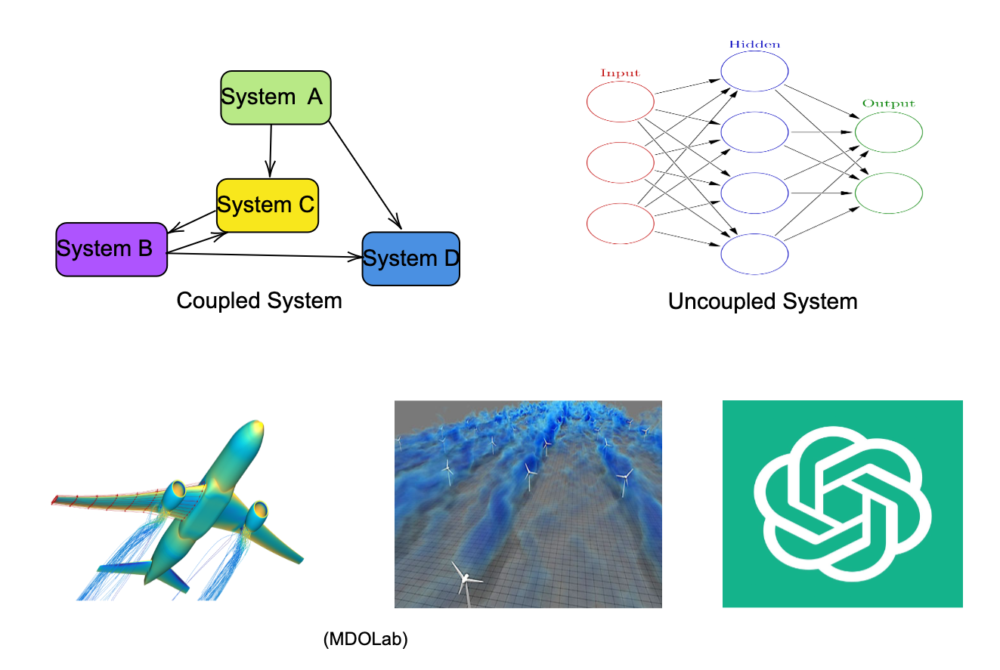
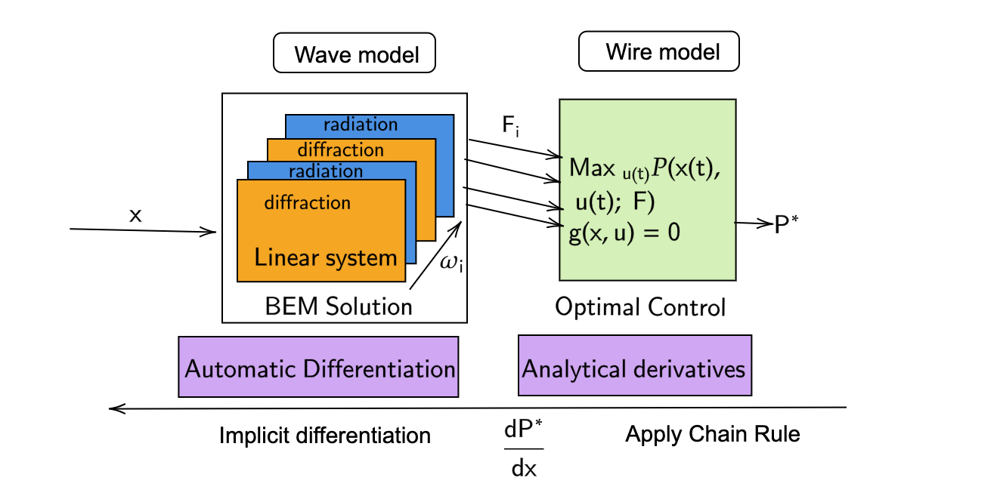

# {.title-slide .centeredslide background-iframe="https://saforem2.github.io/grid-worms-animation/" loading="lazy"}

::: {style="background-color: rgba(34, 34, 35, 0.75); border-radius: 10px; text-align:center; padding: 0px; padding-left: 1.5em; padding-right: 1.5em; max-width: min-content; min-width: max-content; margin-left: auto; margin-right: auto; padding-top: 0.2em; padding-bottom: 0.2em; line-height: 1.5em!important;"}
Towards $\partial$ifferentiable Engineering Systems.  
Optimizing coupled systems with gradients  
[ &nbsp;]{style="padding-bottom: 0.5rem;"}  
 Kapil Khanal (PhD Candidate)  
SEA Lab, Cornell University  

<!-- Add the Sealab logo below -->

  

:::

---

# Overview

1. [Background: `{Large scale systems}`](#large systems )
    - [Definition](#Coupled systems optimization)
    - [Physical system optimization using backpropagation](#automatic-differentiation)
2. [Differentiable BEM](#sec-diffbem)
    - - [MarineHydro.jl](#sec-marinehydro)
3. [Differentiable wave to wire](#sec-codesign)
    - [Optimal Controls](#wave-to-wire-optimization)
3. [Conclusion](#sec-references)
4. [Extras](#sec-extras)

## Optimizing large systems {.centeredslide}

::: {.columns}
::: {.column width="110%"}
 Can be coupled or uncoupled 

Numerical simulations of subsystems

Transformations on data through mathematical operations
:::

::: {.column width="100%"}

{fig-align="center" width="60%"} 

Optimized using  <code>backpropagation</code> (adjoint). 
:::
:::

## Physical System Optimization {.centeredslide}

:::: {.columns}
::: {.column width="50%"}
::: {.callout-note title="Optimization of the entire system for renewable energy system $(\mathcal{S})$" style="text-align:left; !important"}
The system can be formulated as:

$$
\mathcal{S} = \cup \left\{ \mathcal{R}_{1}(\mathcal{X}), \dots, \mathcal{R}_N(\mathcal{X}) \right\}
$$
and the objective function $(LCOE)$ can be minimized as:
$$
\min_{\mathcal{X}} LCOE(\mathcal{X})
$$
Subject to the following constraints:
$$
\begin{aligned}
    \text{C}_i \quad & \leq 0, \\
    \text{R}_i(\mathcal{X}) \quad & = 0, \quad i = 1, \dots, N \text{ (disciplines)} \\
    \text{coupling}: \quad & \mathcal{Y}_i^{t}(\mathcal{X}) = \mathcal{Y}_{j \neq i}^{t}(\mathcal{X}) \quad \text{(consistency)}
\end{aligned}
$$
Where:
$$
\mathcal{R} \text{ is the analysis residual of each subsystem.}
$$
for example, Hydrodynamics, Controls, Economics etc.
:::
:::
::: {.column width="50%"}
#### Optimizer choice
::: {#fig}
{width=8in height=4.5in }
:::
:::

### Issue : Be able to compute the gradient through the entire simulation of the system.
::::

## Differentiable physics simulations {.centeredslide} 

:::: {.columns .fragment}
::: {.column width="40%"}
::: {.callout-tip title="Differentiable physics simulations" style="text-align:left; !important"}

{fig-align="center" width=3.in height=1.7in}

:::
Compute gradients of the physical process (and controls). 

* Differentiable hydrodynamics numerical solver: <code>MarineHydro.jl</code>.
* Useful in Wave energy converters (WEC) design optimization for maximum power capture.

:::

::: {.column width="60%"}

{fig-align="center" width="100%"}

:::
::::

<!-- ::: {.callout title="" style="text-align:left;!important" .fragment}
Case study: <code>Wave energy converters (WEC) </code>

- Systems that convert wave energy into usable energy.
- Coupled systems that include:
  - Hydrodynamics, Controls, Economics etc
- Design optimization of WECs is a complex problem.
- **Goal**: Optimize the design of WECs to maximize energy capture.
::: -->

## MarineHydro.jl - wave model
:::: {.columns}
::: {.column width="50%"}
- Frequency domain boundary element method (BEM) solver for hydrodynamics.
- Supports reverse-mode automatic differentiation (aka backpropagation)
- Adjoint method for all linear solve is <code>automated</code> in <code>MarineHydro.jl</code>.
- 100% Julia implementation.
- Open-source and extensible.

*   **Key Benefits**:
    *   **Design Optimization**: Integrate into gradient based optimization.
    *   **Sensitivity Analysis**: Understand how changes in inputs affect the simulation output.
:::

::: {.column width="50%"}
{width=10in height=5in }
:::
::::

## Comparison with Finite Differences and Analytical Gradients {.custom-dimensions}
::: {.columns}
::: {.column width="50%" .fragment}
{width=80%}
:::
::: {.column width="50%" .fragment}
{width=80%}
:::
:::

::: {.columns}
::: {.column width="50%" .fragment}
{width=80%}
:::
::: {.column width="50%" .fragment}
{width=80%}
:::
:::

## Diffferentiable Wave to Wire model of WECs {.centeredslide}
### Wave to wire optimization

{fig-align="center" width="80%"}

-  Wave interaction to electrical power output (PTO systems and control strategies)
- For every WEC design, optimal control strategy is computed - nested optimization.
- Need for a differentiable wave to wire model 
- Backpropagation through the inner optimization model

## Conclusion
So far I have shown:

- Differentiable hydrodynamic analysis using MarineHydro.jl

- Differentiable wave to wire model

- Differentiable optimization of coupled systems

- Next: Differentiable optimization of farm of WECs

## **Thank you**{.centeredslide} 

::: {.callout-note title="Questions?" style="font-size: 1.8rem; solid #4CAF50; background-color: #F0F8FF;"}
Thank you for your attention!

Feel free to reach out for any questions or discussions.

**Kapil Khanal**

**Email**: kk733@cornell.edu

:::

## Backup1: Differentiability via Discrete Adjoint Method {.centeredslide}

:::: {.columns}

::: {.column width="55%"}
::: {.callout-tip title="Constrained optimization"}
$$
\begin{align}
\min_{\theta} \quad & J(\phi(\theta), \theta) \\
\text{subject to} \quad & D(\theta) \phi - S(\theta) b(\theta) = 0 \label{eq_linsys}
\end{align}
$$
:::
 where $J$ is the cost function, $D$, $S$ are BEM matrices, and $b$ is the boundary condition.

The total derivative of $J$ with respect to $\theta$ is:
$$
\frac{dJ}{d\theta} = 
\underbrace{\textcolor{skyblue}{\frac{\partial J}{\partial \theta}}}_{\textcolor{skyblue}{\text{Direct}}} + 
\underbrace{\textcolor{orange}{\left( \frac{\partial J}{\partial \phi} \right)^T \frac{\partial \phi}{\partial \theta}}}_{\textcolor{orange}{\text{Indirect}}}
$$
:::

::: {.column width="45%"}
To compute $\textcolor{orange}{\frac{\partial \phi}{\partial \theta}}$, the linear system should be perturbed:
\begin{align}
\frac{\partial (D\phi)}{\partial \theta} &= \frac{\partial (Sb)}{\partial \theta} \\
\end{align}

::: {.callout-tip title="Avoid Perturbing Linear System Many Times"}
- [**Idea**]{.green-text}: Avoid resolving $D(\theta) \phi - S(\theta) b(\theta) = 0$ for every perturbation of $\theta_i \in \mathbb{R}^n$.
- [**Solution**]{.green-text}: Use the adjoint method to compute $\frac{\partial \phi}{\partial \theta}$.
:::
:::

::::

---
Perturb the linear system:

$$
\frac{\partial D}{\partial \theta} \phi + D \frac{\partial \phi}{\partial \theta} = \frac{\partial S}{\partial \theta} b + S \frac{\partial b}{\partial \theta}
$$

$$
D \frac{\partial \phi}{\partial \theta} = S \frac{\partial b}{\partial \theta} + b \frac{\partial S}{\partial \theta} - \phi \frac{\partial D}{\partial \theta}
$$

$$
\frac{\partial \phi}{\partial \theta} = D^{-1} \left( S \frac{\partial b}{\partial \theta} + b \frac{\partial S}{\partial \theta} - \phi \frac{\partial D}{\partial \theta} \right)
$$

Substituting $\frac{\partial \phi}{\partial \theta}$ and grouping terms from left to right
$$
\begin{align}
     \lambda^T  &= \frac{\partial J}{\partial \phi}  D^{-1}\\
      \lambda^T D  &= \frac{\partial J}{\partial \phi}
\end{align}
$$

* This is the adjoint linear solve. The same $D$ matrix is used.

## Implicit Differentiation through solvers {.incremental}

The gradient of $J$ with respect to $\theta$ is then expressed as: 
$$
\begin{equation}
\frac{\partial J}{\partial \theta} = \frac{\partial J}{\partial \theta} +  \lambda^T \left( \frac{\partial b}{\partial\theta}S + b\frac{\partial S}{\partial\theta} -  \phi\frac{\partial D}{\partial\theta} \right)
\label{eq:grad_theta}
\end{equation}
$$

All individual partials are computed using Automatic Differentiation. 

- Similar derivation required for all linear and non-linear solves.
- Implicit Differentiation **at the solution**.
* Multibody multidof linear solve
* Transfer function 
* Extends to iterative solvers (GMRES, etc.) and nonlinear solvers (Newton, etc.) as well.